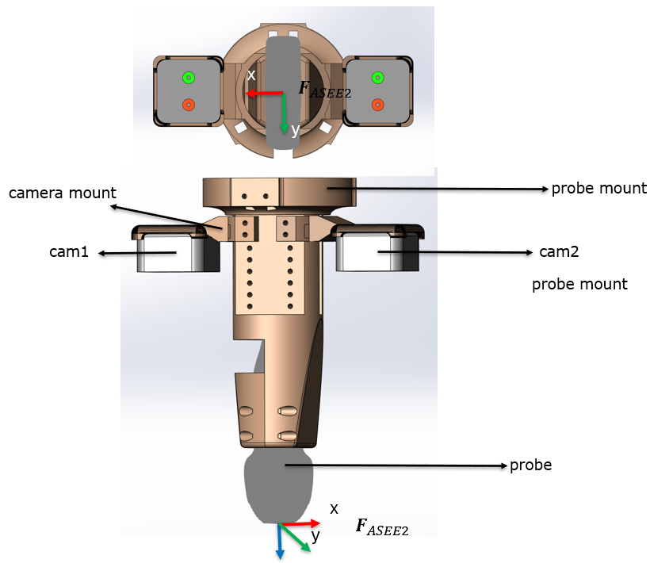
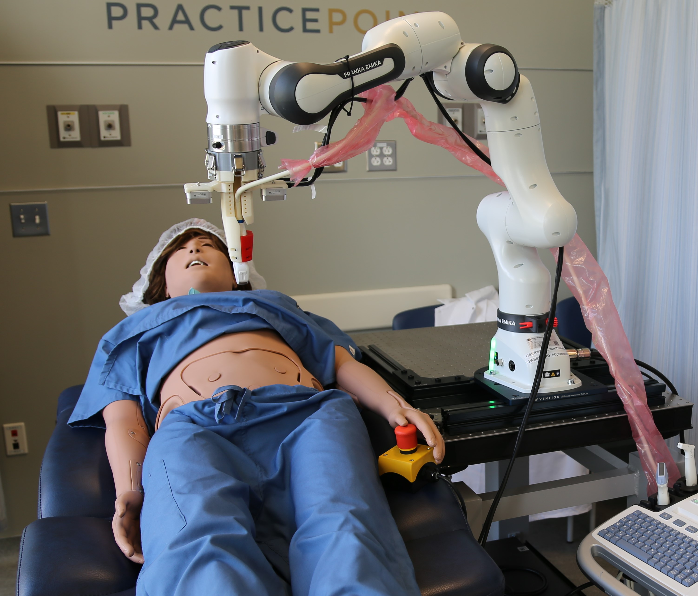

# Active-Sensing End-Effector (ASEE) 2.0+
End effector for robotic ultrasound applications. This is an algorithmically upgraded version of [```ASEE2.0```](https://arxiv.org/abs/2503.05569).




See our first generation prototype [```ASEE1.0```](https://ieeexplore.ieee.org/abstract/document/9932673).

## Installation
### 0. dependencies

```ASEE2.0``` is developed and tested on Ubuntu 20.04 & ROS Noetic.

### 1. install python packages
```sh
pip3 install numpy
pip3 install scikit-learn
pip3 install pyrealsense2
pip3 install open3d
```

### 2. clone the repository under a catkin workspace
```sh
cd catkin_ws/src
git clone https://github.com/MXHsj/asee2.git
catkin_make
```

## Usage

### 0. configure hardware
The CAD model of ASEE 2.0 can be found under ```cad``` folder. By default, it uses a GE C1-6 curvi-linear probe.

Make sure two realsense cameras are available. Confirm their serial numbers using ```scripts/test_stream_cam.py``` script. Then, change the default serial numbers inside ```asee2_core/constants.py```

### 1. launch the driver
```sh
roslaunch asee2 asee2_bringup.launch
```

### 2. ROS topics
| name | description |
| :---: | :---: |
| ```/asee2/cam1/rgb``` | RGB frames from camera1  |
| ```/asee2/cam2/rgb``` | RGB frames from camera2 |
| ```/asee2/cam1/depth``` | depth frames from camera1  |
| ```/asee2/cam2/depth``` | depth frames from camera2 |
| ```/asee2/merged/pcd``` | combined pointcloud data from both cameras |
| ```/asee2/surface/coeff``` | parameters of the quadratic surface fitted to the combined pointcloud  |
| ```/asee2/normal_vector``` | normal vector at the probe tip, w.r.t camera1 coordinate |

### 3. robot-integration example: achieving real-time orientation control for robotic ultrasound



By subscribing to the ```/asee2/normal_vector``` topic, the robot manipulator can be controlled to track the normal vector of its contacting surface. This feature is useful for robotic ultrasound scanning where the probe needs to be maintained at certain angle throughout the scan. (A tilted angle can be applied to the normal vector depending on the application).

Below is a demo video of tracking the normal direction of a surface (1X Speed).


## Citations
- ```ASEE 2.0```
```tex
@misc{zhetpissov2025asee20activesensingendeffectorrobotic,
    title={A-SEE2.0: Active-Sensing End-Effector for Robotic Ultrasound Systems with Dense Contact Surface Perception Enabled Probe Orientation Adjustment}, 
    author={Yernar Zhetpissov and Xihan Ma and Kehan Yang and Haichong K. Zhang},
    year={2025},
    eprint={2503.05569},
    archivePrefix={arXiv},
    primaryClass={cs.RO},
    url={https://arxiv.org/abs/2503.05569}, 
}
```

- ```ASEE 1.0```
```
@ARTICLE{9932673,
author={Ma, Xihan and Kuo, Wen-Yi and Yang, Kehan and Rahaman, Ashiqur and Zhang, Haichong K.},
journal={IEEE Robotics and Automation Letters}, 
title={A-SEE: Active-Sensing End-Effector Enabled Probe Self-Normal-Positioning for Robotic Ultrasound Imaging Applications}, 
year={2022},
volume={7},
number={4},
pages={12475-12482},
keywords={Probes;Sensors;Robots;Imaging;Real-time systems;Robot kinematics;End effectors;Medical robots and systems;robotics and automation in life sciences;sensor-based control},
doi={10.1109/LRA.2022.3218183}}
```